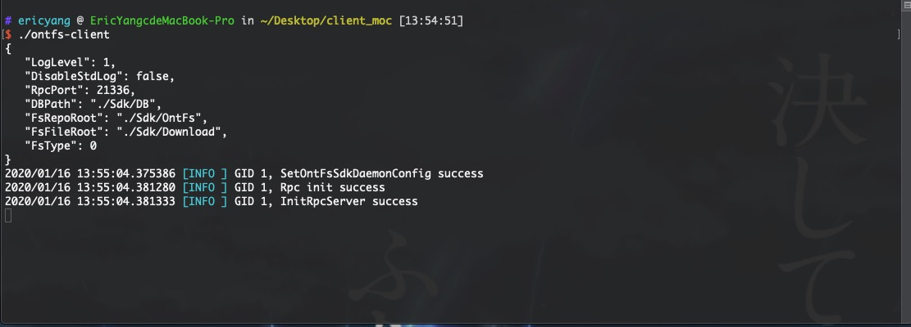

## ONTFS Client 使用文档


#### 工具

1. client 客户端 [下载地址](http://ontfs.io/)
2. 钱包文件(.dat)
   1. [测试币申请地址](http://ontfs.io/)


#### 使用步骤

##### step1

新建 config.json 文件，放置在 ontfs-client 同级目录下

```json
{
	"DBPath": "./Sdk/DB",
	"FsRepoRoot": "./Sdk/OntFs",
	"FsFileRoot": "./Sdk/Download",  // 文件下载目录
	"RpcPort": 21336,					// 客户端默认启动端口
	"LogLevel": 1,
	"DisableStdLog": false
}

```


通过 cmd 命令或者双击 Client 程序启动，Client会自动读取 config.json 配置




##### step2

调用 RPC API 启动sdk，需确保sdk已初始化，只需一次: `./ontfs-client service start`

```json
APIURL: http://localhost:21336

{
  "jsonrpc": "2.0",
  "method": "startsdk",
  "params": [
        {
        "ChainRpcAddr": "http://128.1.40.229:20336",  
        "WalletPath": "",
        "WalletPwd": "",
        "GasPrice": 0,
        "GasLimit": 20000,
        "PdpVersion": 1,
        "P2pProtocol": "tcp",
        "P2pListenAddr": "0.0.0.0:20556",
        "P2pNetworkId": 7,
        "BlockConfirm": 0
        }
  ],
  "id": "1"
}
```


启动完成之后，即可根据 API 接口文档使用 ONTFS Client

Please view [RPC API Documentation](https://docs.ontfs.io/) for detail.

